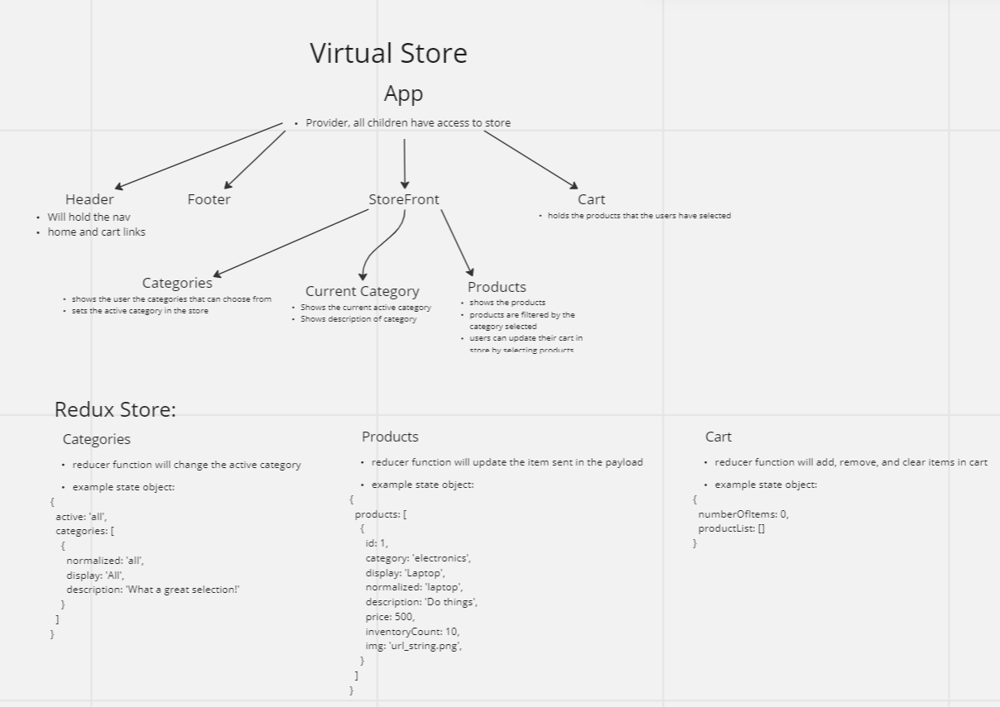

# Virtual Store

## Overview
This site is a virtual store that can show users what products are for sale. The items can be sorted by category and added to a cart. By clicking the cart icon, they can see how many items are in the cart. It can also keeps track of inventory by incrementing and decrementing inventory counts when a user adds and removes items from their cart.

[Deployed Site](https://helpful-kitsune-28bacf.netlify.app/)

## UML

## Available Scripts

In the project directory, you can run:

### `npm start`

Runs the app in the development mode.\
Open [http://localhost:3000](http://localhost:3000) to view it in your browser.

The page will reload when you make changes.\
You may also see any lint errors in the console.

### `npm test`

Launches the test runner in the interactive watch mode.\
See the section about [running tests](https://facebook.github.io/create-react-app/docs/running-tests) for more information.

### `npm run build`

Builds the app for production to the `build` folder.\
It correctly bundles React in production mode and optimizes the build for the best performance.

The build is minified and the filenames include the hashes.\
Your app is ready to be deployed!

### Change Logs
nov-07-2022 @ 1910 - redux store holds categories, cart and products, products are displayed and can be filtered by category

nov-08-2022 @ 1907 - cart features fully functioning